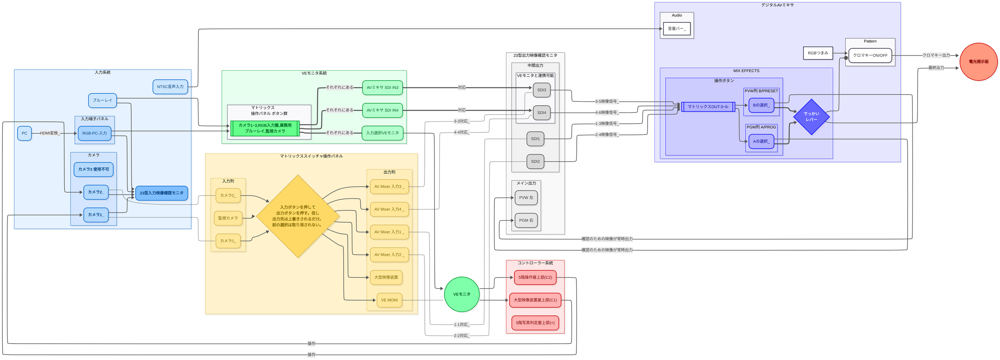

以下のコードをコピーして、mermaidchart.comに貼り付けて。

```mermaid
---
config:
  theme: redux
  themeVariables:
    primaryColor: '#f0f0f0'
    primaryTextColor: '#323232'
    primaryBorderColor: '#888888'
    lineColor: '#555555'
    secondaryColor: '#ebebeb'
    tertiaryColor: '#ffffff'
  flowchart:
    useMaxWidth: false
    htmlLabels: true
    curve: basis
    rankSpacing: 80
    nodeSpacing: 50
    defaultRenderer: elk
  look: neo
  layout: dagre
---
flowchart LR
 subgraph Camera["カメラ"]
        C1("カメラ1_")
        C2("カメラ2_")
        C3("カメラ3 使用不可")
  end
 subgraph InputPanel["入力端子パネル"]
        InputPanelRGB("RGB-PC-入力")
  end
 subgraph Input["入力系統"]
        Camera
        PC("PC")
        BlueRay("ブルーレイ")
        NTSC("NTSC音声入力")
        InputPanel
        InputView("23型入力映像確認モニタ")
  end
 subgraph Controller["コントローラー系統"]
        OP1("5階操作屋上部(C2)")
        OP2("大型映像装置屋上部(C1)")
        OP3("5階写真判定屋上部(×)")
  end
 subgraph InputButtons["入力列"]
        ICW("監視カメラ")
        IC1("カメラ1_")
        IC2("カメラ2_")
  end
 subgraph OutputButtons["出力列"]
        大型映像装置("大型映像装置")
        VE_OUT("VE MONI")
        AV1("AV Mixer 入力1 _")
        AV2("AV Mixer 入力2 _")
        AV3("AV Mixer 入力3 _")
        AV4("AV Mixer 入力4 _")
  end
 subgraph Matrix["マトリックススイッチャ操作パネル"]
        InputButtons
        S{"入力ボタンを押して<br>出力ボタンを押す。但し<br>出力先は上書きされるだけ。<br>前の選択は取り消されない。"}
        OutputButtons
  end
 subgraph MBs["マトリックス<br>操作パネル ボタン群"]
        MB[["カメラ1~3,RGB入力盤,業務用ブルーレイ,監視カメラ"]]
  end
 subgraph VEMonitor["VEモニタ系統"]
        VE_Monitor("入力選択VEモニタ")
        VE_SDI3("AVミキサ SDI IN3")
        VE_SDI4("AVミキサ SDI IN4")
        MBs
  end
 subgraph PGM4["PGM列 A/PROG"]
        AMOut("Aの選択_")
  end
 subgraph PVW4["PVW列 B/PRESET"]
        BMOut("Bの選択_")
  end
 subgraph Buttons["操作ボタン"]
        FourButton[["マトリックスOUT-3~6-"]]
        PGM4
        PVW4
  end
 subgraph MIX["MIX EFFECTS"]
        Buttons
        Switch{"でっかい<br>レバー"}
  end
 subgraph Pattern["Pattern"]
        CHROMAKEY("クロマキーON/OFF")
  end
 subgraph Audio["Audio"]
        AudioGain["音量バー_"]
  end
 subgraph MixerSystem["デジタルAVミキサ"]
        MIX
        RGBOP["RGBつまみ"]
        Pattern
        Audio
  end
 subgraph MainOut["メイン出力"]
        PVW("PVW 左")
        PGM("PGM 右")
  end
 subgraph VEish["VEモニタと連携可能"]
        SDI3("SDI3")
        SDI4("SDI4")
  end
 subgraph MiddleOut["中間出力"]
        SDI1("SDI1")
        SDI2("SDI2")
        VEish
  end
 subgraph OutputMonitor["23型出力映像確認モニタ"]
        MainOut
        MiddleOut
  end
    C1 --> InputView
    C2 --> InputView
    PC -- HDMI変換_ --> InputPanelRGB
    InputPanelRGB --> InputView & MB
    BlueRay --> InputView & MB
    VEM(("VEモニタ")) --> OP1 & OP2
    OP1 -- 操作 --> C2
    OP2 -- 操作 --> C1
    ICW --> S
    IC1 --> S
    IC2 --> S
    S --> 大型映像装置 & VE_OUT & AV1 & AV2 & AV3 & AV4
    C1 -.- IC1
    C2 -.- IC2
    VE_OUT -.- VEM
    MB == それぞれにある === VE_Monitor & VE_SDI3 & VE_SDI4
    VE_Monitor --> VEM
    FourButton --> AMOut & BMOut
    AMOut ==> Switch
    BMOut ==> Switch
    RGBOP --> CHROMAKEY
    Switch --o CHROMAKEY
    NTSC --> AudioGain
    AV1 -. 1-1対応_ .- SDI1
    AV2 -. 2-2対応_ .- SDI2
    AV3 -. 3-3対応_ .- SDI3
    AV4 -. 4-4対応_ .- SDI4
    VE_SDI3 == 対応 ==> SDI3
    VE_SDI4 == 対応 ==> SDI4
    SDI1 -- 1-3映像信号_ --> FourButton
    SDI2 -- 2-4映像信号_ --> FourButton
    SDI3 -- 3-5映像信号_ --> FourButton
    SDI4 -- 4-6映像信号_ --> FourButton
    AMOut -- 確認のための映像が常時出力 --> PVW
    BMOut -- 確認のための映像が常時出力 --> PGM
    Switch -- 最終出力 --> Final(("電光掲示板"))
    CHROMAKEY -- クロマキー出力 ---> Final
     C1:::cameraNode
     C2:::cameraNode
     C3:::cameraNode
     InputPanelRGB:::panelNode
     PC:::inputDevice
     BlueRay:::inputDevice
     NTSC:::inputDevice
     InputView:::monitorNode
     OP1:::controllerNode
     OP2:::controllerNode
     OP3:::controllerNode
     ICW:::matrixButton
     IC1:::matrixButton
     IC2:::matrixButton
     大型映像装置:::matrixButton
     VE_OUT:::matrixButton
     AV1:::matrixButton
     AV2:::matrixButton
     AV3:::matrixButton
     AV4:::matrixButton
     S:::switchNode
     MB:::centralDevice
     VE_Monitor:::veNode
     VE_SDI3:::veNode
     VE_SDI4:::veNode
     AMOut:::mixerButton
     BMOut:::mixerButton
     FourButton:::mixerButton
     Switch:::mainSwitch
     PVW:::outputMonitor
     PGM:::outputMonitor
     SDI3:::sdiNode
     SDI4:::sdiNode
     SDI1:::sdiNode
     SDI2:::sdiNode
     VEM:::centralNode
     Final:::finalOutput
    classDef cameraNode fill:#b3d9ff,stroke:#0066cc,color:#004080,font-weight:bold
    classDef inputDevice fill:#cce6ff,stroke:#0066cc,color:#004080
    classDef panelNode fill:#a6d2ff,stroke:#0066cc,color:#004080
    classDef monitorNode fill:#80bfff,stroke:#0066cc,color:#004080,font-weight:bold
    classDef controllerNode fill:#ffb3b3,stroke:#cc0000,color:#800000
    classDef matrixButton fill:#ffe699,stroke:#d6b656,color:#806600
    classDef switchNode fill:#ffd966,stroke:#d6b656,color:#806600,font-weight:bold
    classDef veNode fill:#b3ffcc,stroke:#009933,color:#006622
    classDef centralDevice fill:#66ff8c,stroke:#009933,color:#006622,font-weight:bold
    classDef centralNode fill:#80ffaa,stroke:#009933,color:#006622,font-weight:bold,stroke-width:2px,border-radius:50%
    classDef mixerButton fill:#b3b3ff,stroke:#0000ff,color:#000099
    classDef mainSwitch fill:#6666ff,stroke:#0000ff,color:#ffffff,font-weight:bold
    classDef outputMonitor fill:#e6e6e6,stroke:#4d4d4d,color:#333333
    classDef sdiNode fill:#d9d9d9,stroke:#4d4d4d,color:#333333
    classDef finalOutput fill:#ff9980,stroke:#cc0000,color:#800000,font-weight:bold,stroke-width:2px
    style Camera fill:#d4e6ff,stroke:#0059b3
    style InputPanel fill:#d4e6ff,stroke:#0059b3
    style InputButtons fill:#ffeeba,stroke:#d6b656
    style OutputButtons fill:#ffeeba,stroke:#d6b656
    style PGM4 fill:#ccccff,stroke:#0000ff
    style PVW4 fill:#ccccff,stroke:#0000ff
    style Buttons fill:#ccccff,stroke:#0000ff
    style MIX fill:#d9d9ff,stroke:#3333ff
    style MainOut fill:#f2f2f2,stroke:#4d4d4d
    style MiddleOut fill:#f2f2f2,stroke:#4d4d4d
    style Input fill:#e6f2ff,stroke:#0066cc
    style Controller fill:#ffe6e6,stroke:#cc0000
    style Matrix fill:#fff2cc,stroke:#d6b656
    style VEMonitor fill:#e6ffee,stroke:#009933
    style MixerSystem fill:#e6e6ff,stroke:#4d4dff
    style OutputMonitor fill:#f9f9f9,stroke:#666666
```
