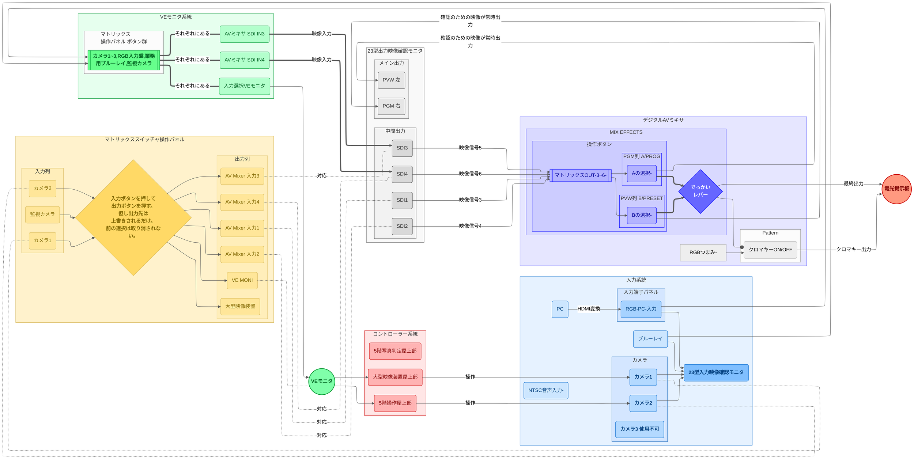

```mermaid
%%{
  init: {
    'theme': 'neutral',
    'themeVariables': {
      'primaryColor': '#f0f0f0',
      'primaryTextColor': '#323232',
      'primaryBorderColor': '#888888',
      'lineColor': '#555555',
      'secondaryColor': '#ebebeb',
      'tertiaryColor': '#ffffff'
    },
    'flowchart': {
      'useMaxWidth': false,
      'htmlLabels': true,
      'curve': 'basis',
      'rankSpacing': 80,
      'nodeSpacing': 50,
      'defaultRenderer': 'elk'
    }
  }
}%%

graph LR
    %% 入力系統
    subgraph Input["入力系統"]
        style Input fill:#e6f2ff,stroke:#0066cc
        
        subgraph Camera["カメラ"]
            style Camera fill:#d4e6ff,stroke:#0059b3
            C1(カメラ1):::cameraNode
            C2(カメラ2):::cameraNode
            C3(カメラ3 使用不可):::cameraNode
        end
        
        PC(PC):::inputDevice
        BlueRay(ブルーレイ):::inputDevice
        NTSC(NTSC音声入力-):::inputDevice
        
        subgraph InputPanel["入力端子パネル"]
            style InputPanel fill:#d4e6ff,stroke:#0059b3
            InputPanelRGB(RGB-PC-入力):::panelNode
        end
        
        InputView(23型入力映像確認モニタ):::monitorNode
        
        C1 --> InputView
        C2 --> InputView
        PC -->|HDMI変換| InputPanelRGB
        InputPanelRGB --> InputView
        BlueRay-->InputView
    end
    
    %% カメラとコントローラーの接続
    subgraph Controller["コントローラー系統"]
        style Controller fill:#ffe6e6,stroke:#cc0000
        OP1(5階操作屋上部):::controllerNode
        OP2(大型映像装置屋上部):::controllerNode
        OP3(5階写真判定屋上部):::controllerNode
    end
    
    VEM((VEモニタ)):::centralNode --> OP1 --> |操作|C2
    VEM --> OP2 --> |操作|C1
    %%OP3 ---|使用不可|C3
    
    %% マトリックス部分
    subgraph Matrix["マトリックススイッチャ操作パネル"]
        style Matrix fill:#fff2cc,stroke:#d6b656
        
        subgraph InputButtons["入力列"]
            style InputButtons fill:#ffeeba,stroke:#d6b656
            ICW(監視カメラ):::matrixButton
            IC1(カメラ1):::matrixButton
            IC2(カメラ2):::matrixButton
        end
        
        S{入力ボタンを押して<br>出力ボタンを押す。<br>但し出力先は<br>上書きされるだけ。<br>前の選択は取り消されない。}:::switchNode
        
        subgraph OutputButtons["出力列"]
            style OutputButtons fill:#ffeeba,stroke:#d6b656
            大型映像装置(大型映像装置):::matrixButton
            VE_OUT(VE MONI):::matrixButton
            AV1(AV Mixer 入力1):::matrixButton
            AV2(AV Mixer 入力2):::matrixButton
            AV3(AV Mixer 入力3):::matrixButton
            AV4(AV Mixer 入力4):::matrixButton
        end
        
        ICW --> S
        IC1 --> S
        IC2 --> S
        
        S --> 大型映像装置
        S --> VE_OUT
        S --> AV1
        S --> AV2
        S --> AV3
        S --> AV4
    end
    
    C1 -.- IC1
    C2 -.- IC2
    VE_OUT -.- VEM
    
    %% VEモニタ系統
    subgraph VEMonitor["VEモニタ系統"]
        style VEMonitor fill:#e6ffee,stroke:#009933
        VE_Monitor(入力選択VEモニタ):::veNode
        VE_SDI3(AVミキサ SDI IN3):::veNode
        VE_SDI4(AVミキサ SDI IN4):::veNode
        subgraph MBs["マトリックス<br>操作パネル ボタン群"]
            MB[["カメラ1~3,RGB入力盤,業務用ブルーレイ,監視カメラ"]]:::centralDevice
        end
        
        
        MB ===|それぞれにある| VE_Monitor
        MB ===|それぞれにある| VE_SDI3
        MB ===|それぞれにある| VE_SDI4
    end
    
    InputPanelRGB --> MB
    BlueRay --> MB
    VE_Monitor --> VEM
    
    %% AVミキサー
    subgraph MixerSystem["デジタルAVミキサ"]
        style MixerSystem fill:#e6e6ff,stroke:#4d4dff
        
        subgraph MIX["MIX EFFECTS"]
            style MIX fill:#d9d9ff,stroke:#3333ff
            
            subgraph Buttons["操作ボタン"]
                style Buttons fill:#ccccff,stroke:#0000ff
                FourButton[["マトリックスOUT-3~6-"]]:::mixerButton
                
                subgraph PGM4["PGM列 A/PROG"]
                    style PGM4 fill:#ccccff,stroke:#0000ff
                    AMOut(Aの選択-):::mixerButton
                end
                
                subgraph PVW4["PVW列 B/PRESET"]
                    style PVW4 fill:#ccccff,stroke:#0000ff
                    BMOut(Bの選択-):::mixerButton
                end
                
                FourButton --> AMOut
                FourButton --> BMOut
            end
            
            Switch{でっかい<br>レバー}:::mainSwitch
            AMOut ==> Switch
            BMOut ==> Switch
        end

        RGBOP[RGBつまみ-]-->CHROMAKEY(クロマキーON/OFF)
        Switch--o CHROMAKEY

        subgraph Pattern
            CHROMAKEY
        end
    end
    
    %% 出力モニタ
    subgraph OutputMonitor["23型出力映像確認モニタ"]
        style OutputMonitor fill:#f9f9f9,stroke:#666666
        
        subgraph MainOut["メイン出力"]
            style MainOut fill:#f2f2f2,stroke:#4d4d4d
            PVW(PVW 左):::outputMonitor
            PGM(PGM 右):::outputMonitor
        end
        
        subgraph MiddleOut["中間出力"]
            style MiddleOut fill:#f2f2f2,stroke:#4d4d4d
            SDI1(SDI1):::sdiNode
            SDI2(SDI2):::sdiNode
            SDI3(SDI3):::sdiNode
            SDI4(SDI4):::sdiNode
        end
    end
    
    %% 接続関係
    AV1 -.-|対応| SDI1
    AV2 -.-|対応| SDI2
    AV3 -.-|対応| SDI3
    AV4 -.-|対応| SDI4
    
    VE_SDI3 ==>|映像入力| SDI3
    VE_SDI4 ==>|映像入力| SDI4
    
    SDI1 -->|映像信号3| FourButton
    SDI2 -->|映像信号4| FourButton
    SDI3 -->|映像信号5| FourButton
    SDI4 -->|映像信号6| FourButton
    
    AMOut -->|確認のための映像が常時出力| PVW
    BMOut -->|確認のための映像が常時出力| PGM
    
    %% 最終出力
    Switch -->|最終出力| Final((電光掲示板)):::finalOutput
    CHROMAKEY o--> |クロマキー出力|Final
    
    %% クラススタイル定義
    classDef cameraNode fill:#b3d9ff,stroke:#0066cc,color:#004080,font-weight:bold
    classDef inputDevice fill:#cce6ff,stroke:#0066cc,color:#004080
    classDef panelNode fill:#a6d2ff,stroke:#0066cc,color:#004080
    classDef monitorNode fill:#80bfff,stroke:#0066cc,color:#004080,font-weight:bold
    
    classDef controllerNode fill:#ffb3b3,stroke:#cc0000,color:#800000
    
    classDef matrixButton fill:#ffe699,stroke:#d6b656,color:#806600
    classDef switchNode fill:#ffd966,stroke:#d6b656,color:#806600,font-weight:bold
    
    classDef veNode fill:#b3ffcc,stroke:#009933,color:#006622
    classDef centralDevice fill:#66ff8c,stroke:#009933,color:#006622,font-weight:bold
    classDef centralNode fill:#80ffaa,stroke:#009933,color:#006622,font-weight:bold,stroke-width:2px,border-radius:50%
    
    classDef mixerButton fill:#b3b3ff,stroke:#0000ff,color:#000099
    classDef mainSwitch fill:#6666ff,stroke:#0000ff,color:#ffffff,font-weight:bold
    
    classDef outputMonitor fill:#e6e6e6,stroke:#4d4d4d,color:#333333
    classDef sdiNode fill:#d9d9d9,stroke:#4d4d4d,color:#333333
    
    classDef finalOutput fill:#ff9980,stroke:#cc0000,color:#800000,font-weight:bold,stroke-width:2px

```
